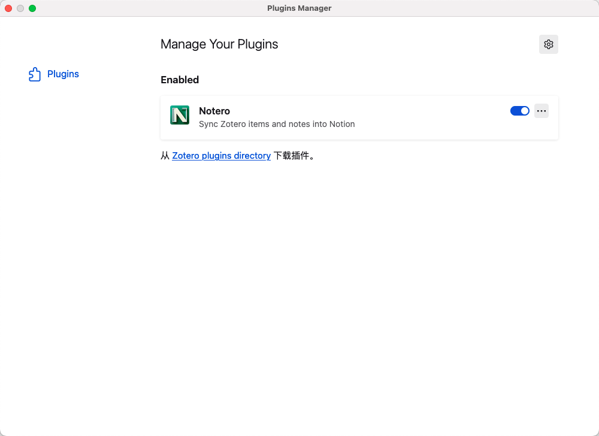
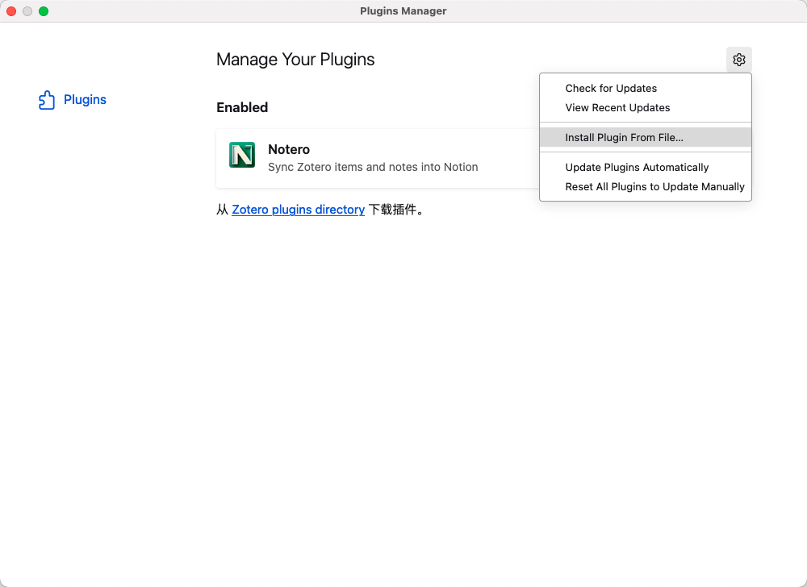
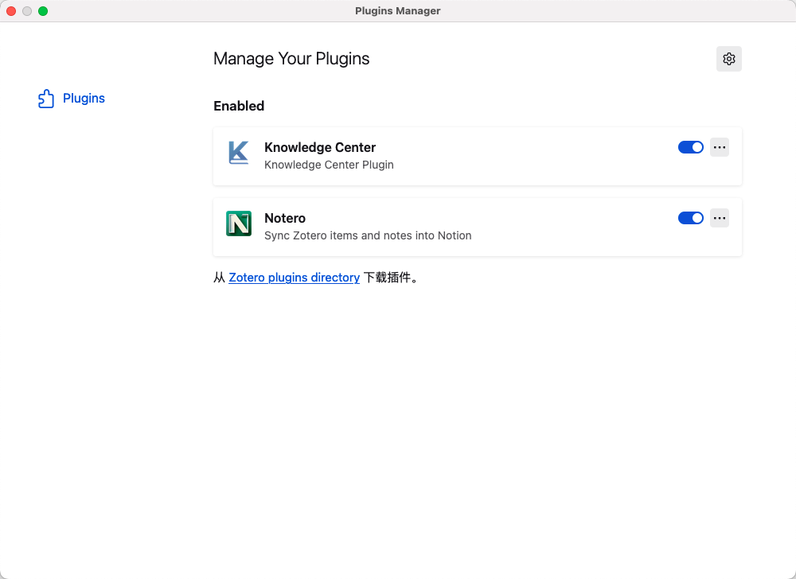
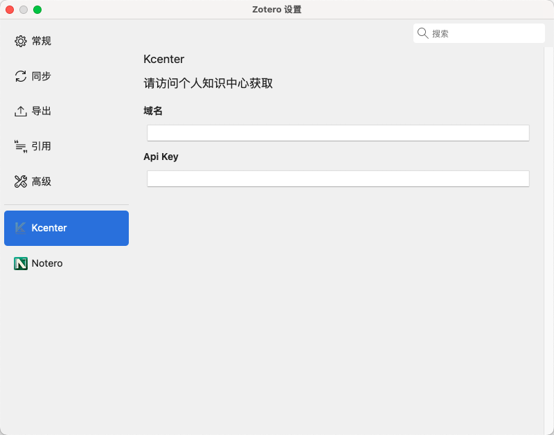
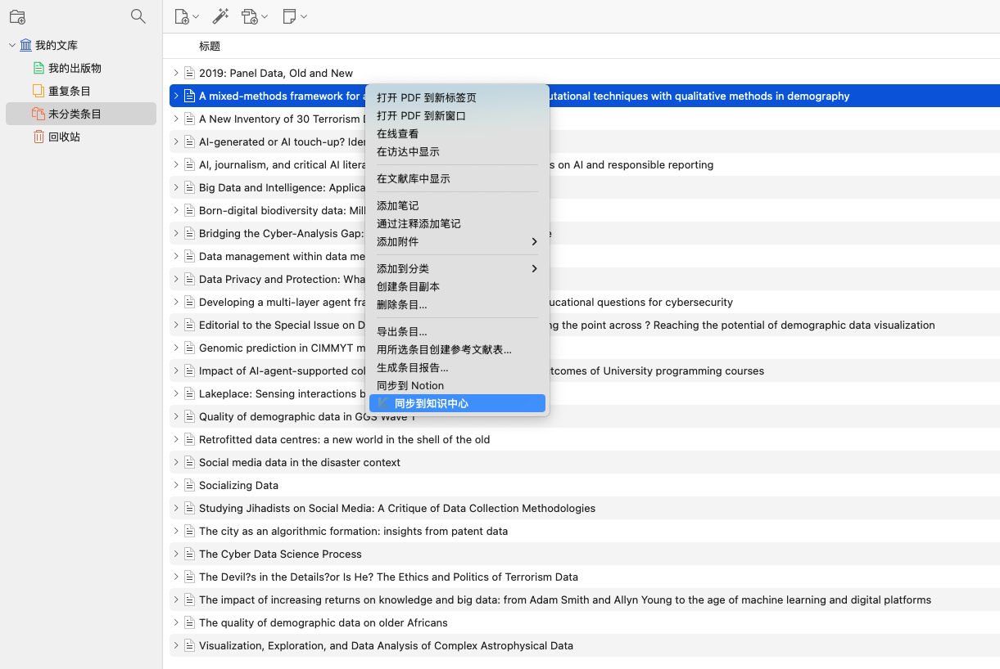
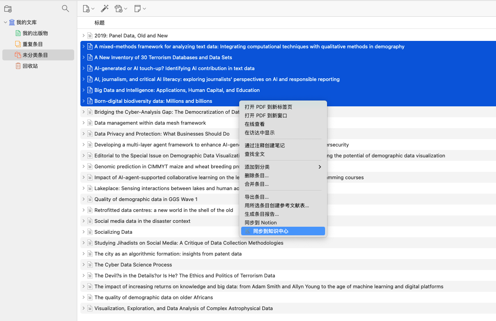

# 个人知识中心 Zotero 插件

将 Zotero 中的期刊文章同步到个人知识中心，利用个人知识中心强大的AI功能来分析和阅读文章。

## 使用方式
1.  请先登录个人知识中心，获取"域名"和"API KEY"

2. 下载最新版本插件 [点击下载](https://github.com/zxing258974/zotero-knowledge-center-plugin/releases)

3. 在菜单栏 "工具">"插件" 菜单打开插件页面</h4>



4. 点击右侧设置图标，选择 "Install Plugin From File" 选项



5. 选择下载的最新版本 zotero-knowledge-center-plugin 插件



6. 在菜单栏 "工具">"知识中心首选项" 菜单打开插件配置页面



7. 请将当前"域名"复制到插件配置页面中，还有生成的 "APIKEY" 复制到插件配置页面中。

8. 右击需要同步的文献 Item，选择"同步到知识中心"菜单，将当前文献同步到个人知识中心。



9. 选中多条文献 Item，右击选择"同步到知识中心"菜单，将当前多条文献同步到个人知识中心。</h4>



10. 打开个人知识中心文献资源查看同步的类容。</h4>  

## 打包流程

```bash
# 提交当前更新
git add .
git commit -m "release: 1.1.15"

# 提交 tag
git tag v1.1.15

# 推送到仓库
git push origin main
# 推送 tag
git push origin v1.1.15
```

github 在 Actions 下自动打包

在 Github Actions 打包出错的情况下修复错误后可以使用以下命令重新打包

```bash
git add .
git commit -m "fix: github release workflow"
git push origin main

git tag -d v1.1.15
git push origin :refs/tags/v1.1.15

git tag v1.1.15
git push origin v1.1.15
```